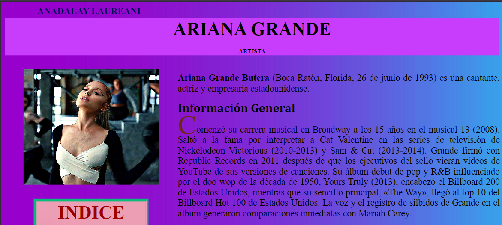
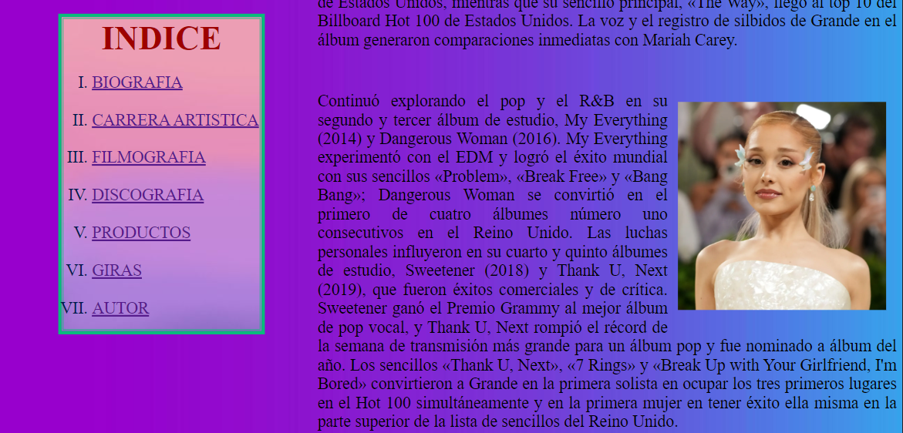
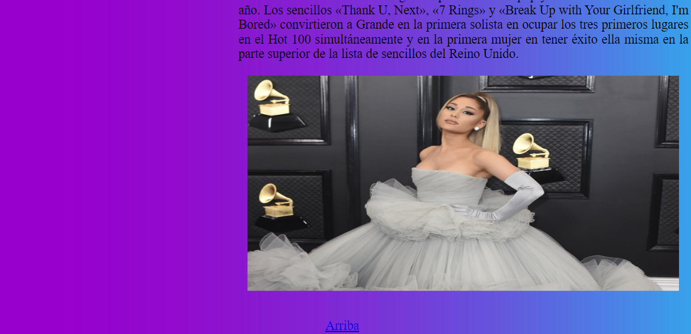
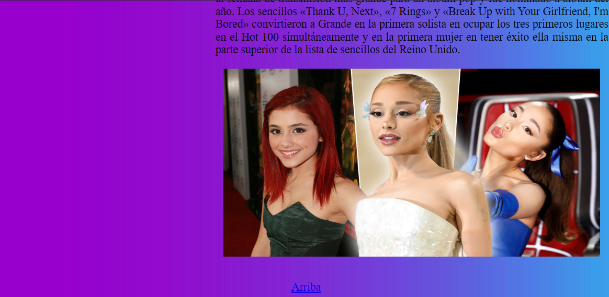

# Portafolio de habilidades TECHNOLOCHICAS PRO

El presente proyecto es una página web sobr Ariana Grande desarrollada para poner en práctica las habilidades obtenidad dentro del bootcamp de desarrollo frontend de Technolochicas PRO.

Fue desarrollado con HTML y CSS, aprovechando mis conocimientos previos en estas tecnologías. 

La página es responsiva (adaptable a diferentes tamaños de pantalla).

[Proyecto Desplegado (https://portafolio-b7-g2-anadalay.vercel.app/)](https://mi-primera-pagina-anadalay.vercel.app/)

## Secciones de mi sitio

## Tecnologías

* HTML
* CSS

---
Desarrollado con 💖 por [Anadalay](https://www.linkedin.com/in/anadalay-laureani-longino-11bbaa26b/) en [TECHNOLOCHICAS PRO](https://tecnolochicas.mx/).